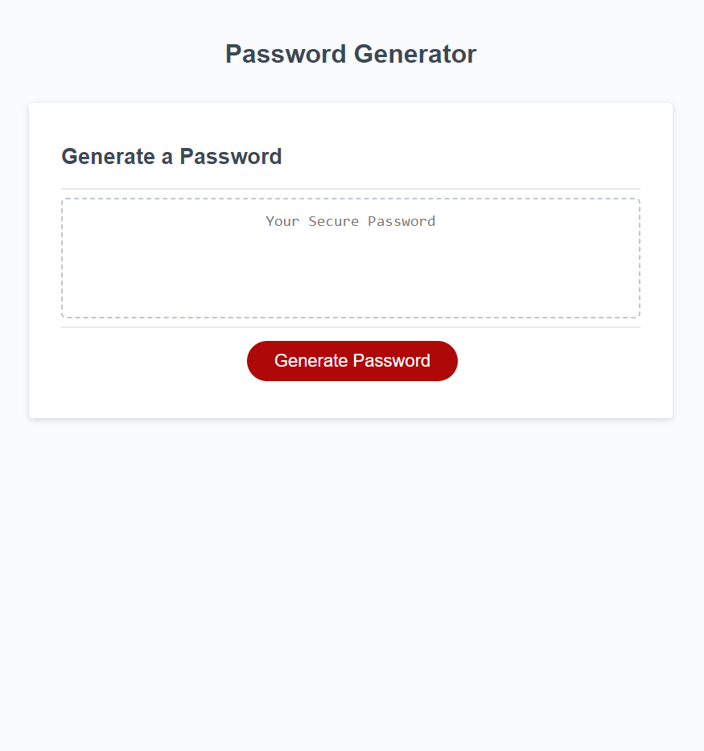

# JavaScript Password Generator

## Description

This project generates a random password using inputs from the user. Once the user clicks on the
red "Generate Password" button they are prompted with a textbox asking them to input a number to
be used as the length of the password. Then they are given four pop-up boxes asking them to pick yes or no for each character type they want in the password, those being lowercase characters, uppercase characters, numeric characters, and special characters. After all the inputs have been given, a randomly generated password is displayed in the text box above the red "Generate Password" button.

[Deployed Application](https://emill0004.github.io/03-JavaScript-Password-Generator/)

